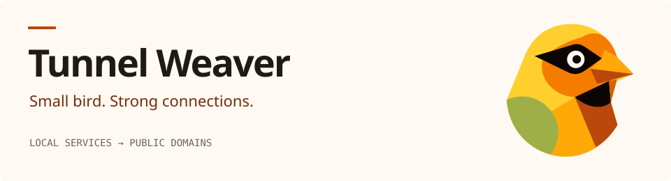

<picture>
  <source media="(prefers-color-scheme: dark)" srcset=".github/brand/header-dark.svg">
  <source media="(prefers-color-scheme: light)" srcset=".github/brand/header-light.svg">
  
</picture>

<p align="center">
  <a href="#building--testing">Build &amp; test</a> ·
  <a href="docs/architecture.md">Architecture</a> ·
  <a href="CONTRIBUTING.md">Contribute</a> ·
  <a href="LICENSE">Apache 2.0</a>
</p>

Tunnel Weaver is an open-core tunneling and reverse proxying system designed for exposing local services to public domains with automated TLS, end-to-end authentication, and multiplexed streams.

| Public endpoints | Authenticated connections | Multiplexed streams |
| --- | --- | --- |
| Expose local services through public domains with automated TLS. | End-to-end authentication between the client and relay. | A Rust workspace with a sans-IO multiplexer at its core. |

## Workspace Overview

The project is structured as a Cargo workspace:

- **`crates/weaver-mux`**: Sans-IO stream multiplexer framing layer (`Frame::parse`).
- **`crates/weaver-proto`**: Shared protocol constants (`PROTOCOL_VERSION`) and core definitions.
- **`crates/weaver-server`**: Relay server binary (Linux-only).
- **`crates/weaver-assets`**: Shared embedded branded HTML error pages and security headers.
- **`crates/weave`**: Tunnel Weaver client CLI binary (Linux, macOS, Windows).
- **`fuzz/`**: LibFuzzer targets executed continuously in CI.

## Prerequisites

- **Rust**: 1.98+ (Rust edition 2024).

## Building & Testing

### Workspace Build

```bash
cargo build --workspace
```

### Running Tests

Run the workspace test suite:

```bash
# On Linux:
cargo test --workspace

# On macOS and Windows (excluding Linux-only server):
cargo test --workspace --exclude weaver-server

# Run ignored end-to-end tests:
cargo test --workspace -- --ignored
```

### Linting & Formatting

```bash
cargo fmt --check
cargo clippy --workspace --all-targets -- -D warnings
cargo deny check
```

## Contributing

See [CONTRIBUTING.md](CONTRIBUTING.md) for contribution guidelines, engineering rules, and architectural decision records (ADRs in `docs/decisions/`). [docs/architecture.md](docs/architecture.md) maps the crate layers and every call that crosses them.

## License

Licensed under the Apache License, Version 2.0. See [LICENSE](LICENSE) for details.
