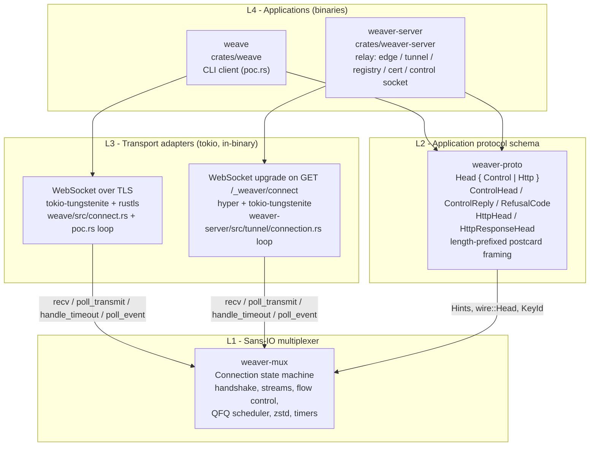
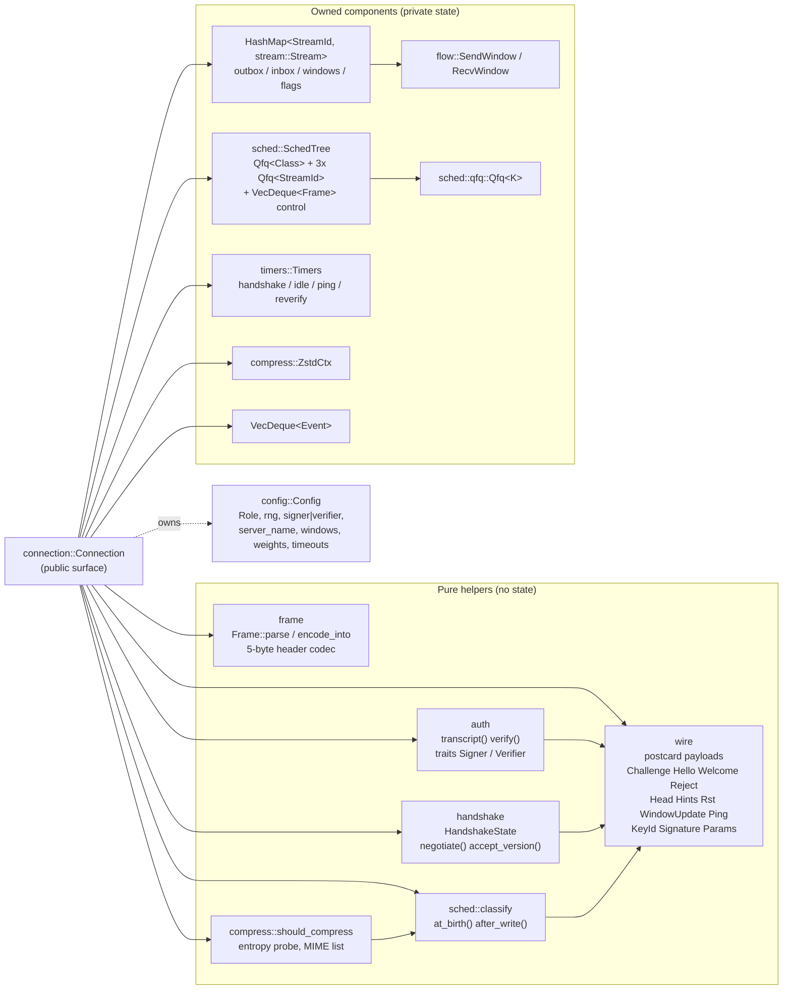
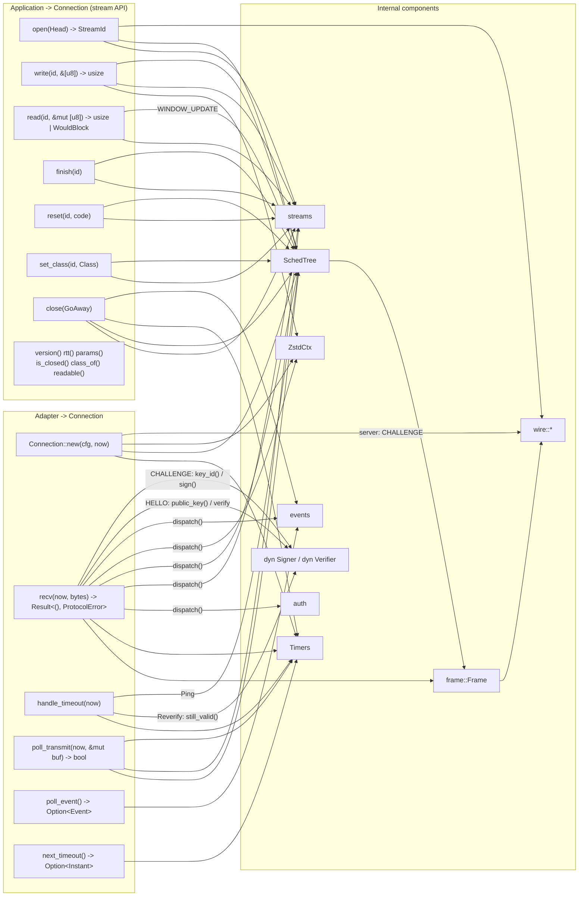
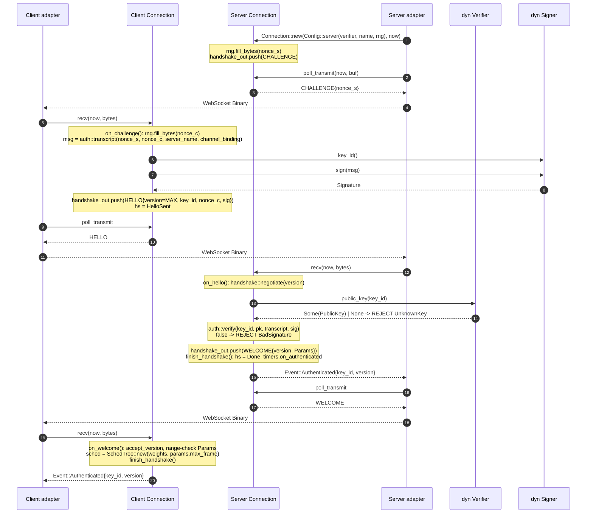
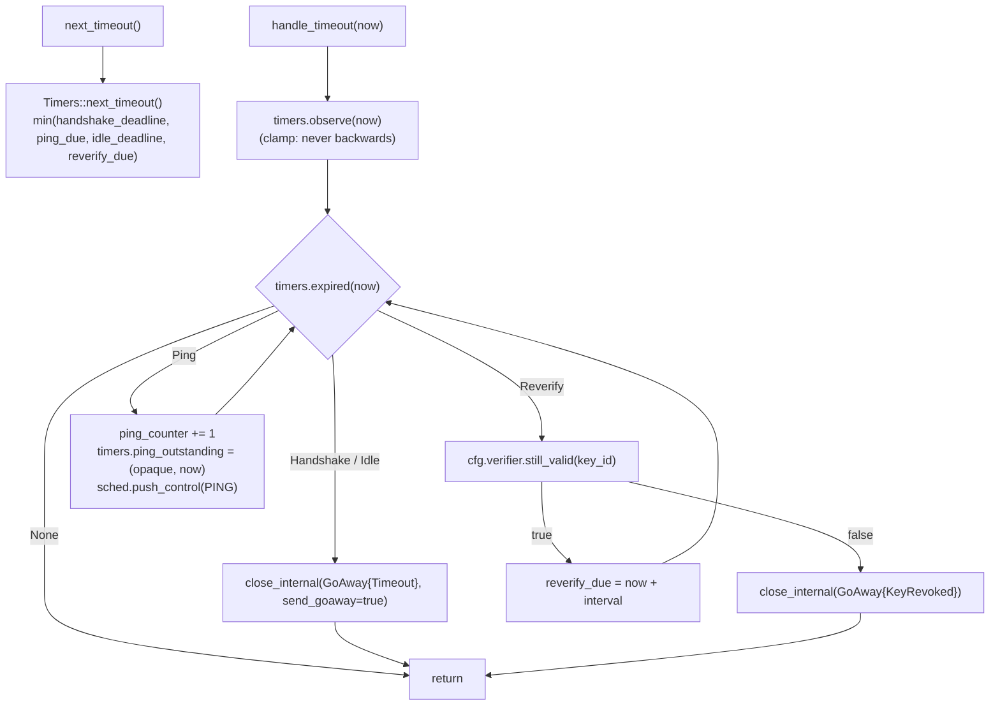
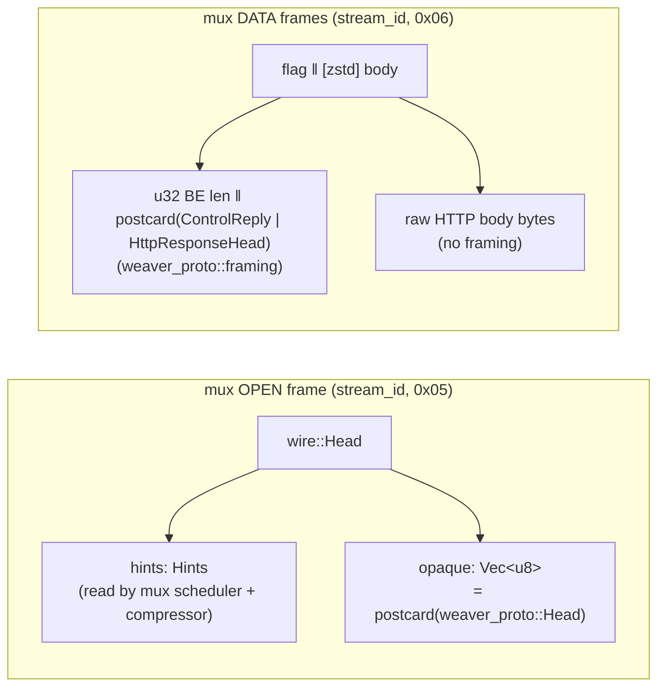
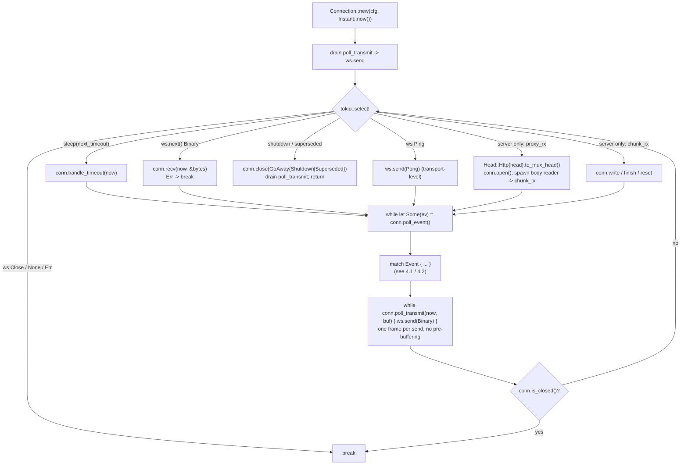
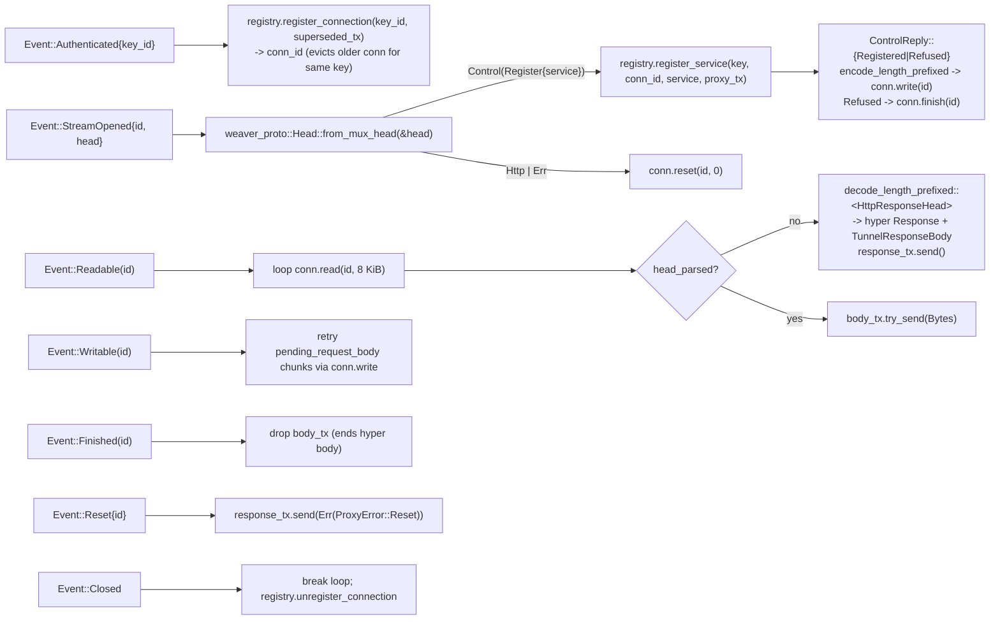
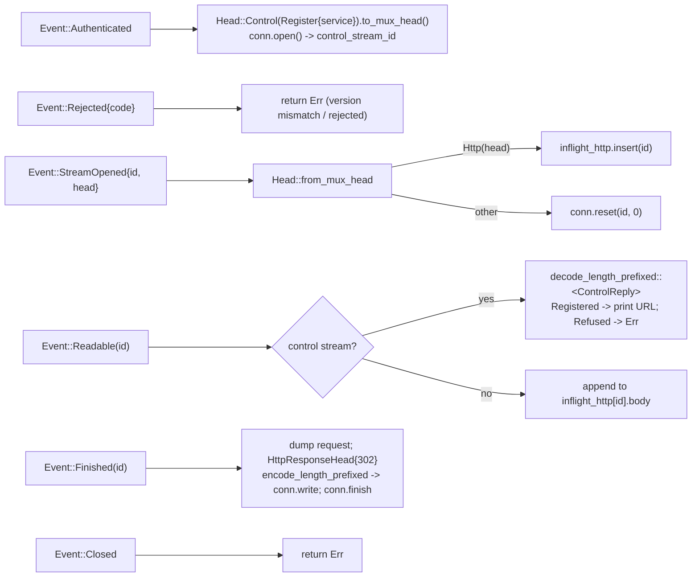

# Abstraction layers: `weaver-mux`, `weaver-proto`, and the adapters

> **Historical.** This audit describes the tree *before* ADR 0004
> (`docs/decisions/0004-stream-policy-and-messages.md`), which resolved
> every finding in section 5 by introducing `StreamPolicy`, per-message
> `Compress`, `send`/`recv_msg`, `weaver-proto::policy`, and the
> `weaver-tokio` adapter crate. It is kept as the rationale for those
> changes; line references point to the pre-ADR-0004 source.

This document maps the crates of the workspace onto the layers they are
supposed to represent, shows the calls that actually cross each boundary,
and lists the places where a layer leaks into a neighbour or where two
APIs cover the same concern.

## 1. Layer map



Intended dependency direction is strictly downward: `weave` and
`weaver-server` depend on both `weaver-proto` and `weaver-mux`;
`weaver-proto` depends on `weaver-mux` for three types only (`Hints`,
`wire::Head`, `KeyId`); `weaver-mux` depends on nothing in the workspace.
`cargo tree` confirms there is no cycle. There is **no L3 crate**: each
binary carries its own tokio event loop that drives a `Connection`.

## 2. `weaver-mux` internals

### 2.1 Module graph

`Connection` (`connection.rs`) is the only stateful public type; every
other module is either a pure helper or a private component it owns.



Enforced boundaries inside the crate:

* `#![forbid(clippy::disallowed_methods)]` + `clippy.toml` ban
  `Instant::now`, `SystemTime::now` and RNG calls. Time enters only as the
  `now: Instant` parameter of `recv`, `poll_transmit`, `handle_timeout`;
  randomness only through `Config::rng`.
* Keys never enter the crate: the client hands in `Box<dyn Signer>`, the
  server `Box<dyn Verifier>`; the crate sees a `KeyId` and a `Signature`.
* `stream`, `timers`, `handshake`, `compress` are private modules;
  `frame`, `wire`, `auth`, `sched`, `flow`, `config`, `error`, `event` are
  public.

### 2.2 The public API and what each call touches



Only `recv`, `handle_timeout` and `new` reach the adapter-supplied traits
(`Signer`, `Verifier`, `Rng`). The stream API never does; it is pure state
mutation plus scheduler bookkeeping.

### 2.3 Handshake sequence (both roles, one diagram)



The `Reject` path emits `Event::Rejected` then `Event::Closed` on the
client, and closes the server side *without* a GOAWAY
(`close_internal(.., send_goaway = false)`, `connection.rs:495-511`).

### 2.4 Data path of one stream, inside the mux

```mermaid
sequenceDiagram
    autonumber
    participant App as Application
    participant C as Connection
    participant St as Stream
    participant Z as ZstdCtx
    participant Q as SchedTree
    participant Ad as Adapter

    App->>C: open(Head{hints, opaque})
    Note over C: classify::at_birth(hints)<br/>Stream::new(window = params.initial_window, open_sent=false)
    C->>Q: add_stream(id, class)
    C->>Q: push_control(OPEN frame)
    C-->>App: StreamId

    App->>C: write(id, data)
    Note over C: first write: compress::should_compress(class, hints, data)
    loop while free_credit() > 1
        C->>Z: compress(chunk) (if On)
        C->>St: outbox.push(flag ‖ body); outbox_bytes += len
    end
    Note over C: classify::after_write -> maybe reclass to Bulk<br/>if open_sent: sched.activate_stream / reclass
    C-->>App: bytes accepted (short -> wants_writable)

    Ad->>C: poll_transmit(now, buf)
    C->>Q: pick()
    Q-->>C: Pick::Control
    C->>Q: pop_control() -> OPEN
    Note over C: on_open_sent(id): open_sent=true, activate_stream
    C->>Q: served(Control, len)
    C-->>Ad: OPEN bytes

    Ad->>C: poll_transmit(now, buf)
    C->>Q: pick()
    Q-->>C: Pick::Stream(id)
    C->>St: outbox.pop_front(); send.consume(len)
    C->>Q: served(Stream(id), class, wire_len, next_len)
    Note over C: if outbox empty && fin_requested -> queue_fin
    C-->>Ad: DATA bytes

    Ad->>C: recv(now, DATA bytes)
    Note over C: on_data(): decompress (cap = 8*max_frame)<br/>recv.on_data(wire_len) -> FlowControl error if over
    C->>St: inbox.push(Chunk)
    C-->>App: Event::Readable(id) (edge-triggered)

    App->>C: read(id, buf)
    C->>St: drain chunks; recv.on_consumed(wire_len)
    Note over C: >= window/2 consumed -> queue_window_update
    C->>Q: push_control(WINDOW_UPDATE)
    C-->>App: n bytes | WouldBlock | Ok(0) after FIN
```

### 2.5 Timer path



Note `poll_transmit` overrides the `sent_at` in `ping_outstanding` when the
PING actually leaves the scheduler (`connection.rs:240-246`), so RTT is
measured from wire departure, not from the timer.

## 3. `weaver-proto`: the layer above the mux

`weaver-proto` is a **schema crate**: no state, no I/O, no mux driving.

```mermaid
classDiagram
    class Head {
        <<enum>>
        Control(ControlHead)
        Http(HttpHead)
        +to_mux_head() Result~weaver_mux::wire::Head, CodecError~
        +from_mux_head(&weaver_mux::wire::Head) Result~Head, CodecError~
    }
    class ControlHead {
        <<enum>>
        Register{service: String}
    }
    class ControlReply {
        <<enum>>
        Registered{hostname}
        Refused{code: RefusalCode, message}
    }
    class RefusalCode {
        <<enum>>
        AlreadyRegistered
        InvalidName
        Unauthorized
        Other(String)
    }
    class HttpHead {
        method, scheme, authority, path
        headers: Vec~(String, Vec~u8~)~
        hints: weaver_mux::Hints
    }
    class HttpResponseHead {
        status: u16
        headers
    }
    class framing {
        <<module>>
        MAX_FRAME_PAYLOAD_LEN = 64 KiB
        encode_length_prefixed(T) Vec~u8~
        decode_length_prefixed(&[u8]) Option~(T, usize)~
    }
    class poc {
        <<module>>
        POC_SECRET_KEY, POC_PUBLIC_KEY, POC_KEY_ID
        poc_identity(&KeyId) Option~(person, machine)~
        derive_hostname(service, machine, person, root)
    }
    class mux_Head["weaver_mux::wire::Head"] {
        hints: Hints
        opaque: Vec~u8~
    }
    Head --> ControlHead
    Head --> HttpHead
    Head ..> mux_Head : postcard(self) -> opaque
    HttpHead --> mux_Hints["weaver_mux::Hints"]
    ControlReply --> RefusalCode
    ControlReply ..> framing : sent as DATA
    HttpResponseHead ..> framing : sent as DATA
    poc ..> mux_KeyId["weaver_mux::KeyId"]
```

How `weaver-proto` layers onto the mux wire:



## 4. Adapters: the two event loops

Both binaries implement the loop prescribed by the `weaver-mux` crate
docs. They are structurally identical.



### 4.1 Server-side event handling (`weaver-server/src/tunnel/connection.rs`)



### 4.2 Client-side event handling (`weave/src/poc.rs`)



### 4.3 End-to-end: a visitor request through every layer

```mermaid
sequenceDiagram
    autonumber
    participant Vis as Visitor (HTTPS)
    participant Edge as edge::https (hyper)
    participant Reg as TunnelRegistry
    participant Prx as tunnel::proxy
    participant Loop as tunnel::connection loop
    participant SM as weaver_mux (server)
    participant WS as WebSocket/TLS
    participant CM as weaver_mux (client)
    participant CLoop as weave poc loop

    Vis->>Edge: GET https://web.laptop.poc.root/
    Edge->>Reg: lookup(host) -> TunnelRoute{proxy_tx}
    Edge->>Prx: forward_visitor_request(req, route, ip, host)
    Note over Prx: strip hop-by-hop, add x-forwarded-*<br/>HttpHead{..., hints: Hints::default()}
    Prx->>Loop: proxy_tx.send(ProxyRequest{head, body, response_tx})
    Loop->>SM: weaver_proto::Head::Http(head).to_mux_head()
    Loop->>SM: conn.open(mux_head) -> id
    Loop->>Loop: spawn body reader -> chunk_tx (Data/Fin/Error)
    Loop->>SM: conn.write(id, chunk) / conn.finish(id)
    Loop->>SM: poll_transmit
    SM-->>WS: OPEN, DATA..., FIN
    WS-->>CM: recv
    CM-->>CLoop: StreamOpened / Readable / Finished
    CLoop->>CM: read(); on Finished: write(len-prefixed HttpResponseHead); finish()
    CM-->>WS: DATA, FIN
    WS-->>SM: recv
    SM-->>Loop: Readable(id)
    Loop->>SM: read(id) -> decode_length_prefixed::<HttpResponseHead>
    Loop->>Prx: response_tx.send(Ok(Response<TunnelResponseBody>))
    Prx-->>Edge: Response
    Edge-->>Vis: 302
    SM-->>Loop: Finished(id) -> drop body_tx
```

## 5. Boundary audit

Legend: **Leak** = a concept crossing a layer it should not;
**Overlap** = two APIs covering one concern; **Asymmetry** = the same
concept handled two different ways; **Contract** = an implicit obligation
the API does not make explicit.

### 5.1 Clean boundaries (worth preserving)

| Boundary | Why it is clean |
|---|---|
| mux ⟂ time / randomness | Only `now` parameters and `Config::rng`; enforced by lint. |
| mux ⟂ keys | `Signer` / `Verifier` traits; mux sees `KeyId` + `Signature` only. |
| mux ⟂ application payload | `wire::Head::opaque` is passed through untouched; `Hints` is the only field the mux reads. |
| mux ⟂ transport | `recv` takes one message, `poll_transmit` yields one frame; no length prefix because the pipe is message-delimited. |
| proto → mux | `weaver-proto` uses exactly `Hints`, `wire::Head`, `KeyId`; never `Connection`. |
| server policy ⟂ mux | Superseding, eviction and cert activation live in `TunnelRegistry`; the mux only carries `CloseCode::Superseded`. |

### 5.2 Findings

1. **Leak — identity policy inside the schema crate.**
   `weaver_proto::poc` (`crates/weaver-proto/src/poc.rs`) holds a secret
   key, `poc_identity(&KeyId) -> (person, machine)` and
   `derive_hostname(...)`. Mapping a key to a person/machine and building
   hostnames is relay policy (the registry's job), not wire schema. It is
   consumed only by `weaver-server/src/tunnel/registry.rs:12` and the two
   PoC key constants in `connection.rs:22` / `weave/src/poc.rs:20`. Once
   the PoC ends, this module should move to the server (identity lookup)
   and to the client (key material), leaving `weaver-proto` key-agnostic.

2. **Asymmetry — request heads and response heads use different
   encodings.** `HttpHead` travels in the mux `OPEN` payload
   (`Head::to_mux_head`, unbounded size — the mux docs acknowledge OPEN
   frames "carry application heads of unbounded size",
   `sched/mod.rs:60-62`), while `HttpResponseHead` and `ControlReply`
   travel as **length-prefixed DATA** capped at 64 KiB
   (`framing::MAX_FRAME_PAYLOAD_LEN`). Two head codecs, two size limits.
   Either both heads should be length-prefixed in DATA (and OPEN carries
   only `Hints`), or the response head should get the same first-class
   treatment. The former also removes the unbounded control-frame issue in
   the scheduler.

3. **Overlap — two protocol version constants that are never
   reconciled.** `weaver_mux::wire::{MIN_VERSION, MAX_VERSION}` is
   negotiated on the wire (HELLO/WELCOME). `weaver_proto::PROTOCOL_VERSION`
   is only ever printed in version strings (`weaver-server/src/main.rs:287`,
   `control/client.rs:237`) and is not carried in `weaver_proto::Head`. If
   the application schema is meant to evolve independently of the mux, it
   needs its own negotiation (e.g. in `ControlHead::Register`); if not, the
   constant is dead and should be removed to avoid the impression that it
   is enforced.

4. **Leak — module path in a public signature.**
   `Head::to_mux_head() -> weaver_mux::wire::Head` names the internal
   module while `weaver-mux` re-exports the same type as
   `weaver_mux::Head`. Same for `weaver_mux::wire::Signature` in
   `weave/src/poc.rs:33`. Cosmetic, but it means the `wire` module cannot be
   made private later without breaking `weaver-proto`.

5. **Overlap — one type, two names.** `wire::Goaway` is a `pub use` alias
   of `error::GoAway` (`wire.rs:22`). Callers import `GoAway` from `error`;
   the only use of `Goaway` is a unit test in `wire.rs` itself. Drop the
   alias.

6. **Contract — a stream is only released after `read` returns
   `Ok(0)`.** `Stream::is_finished` requires `eof_delivered`
   (`stream.rs:114-121`), which is set only when the application calls
   `read` *after* the remote FIN and gets `Ok(0)`. Both adapters read only
   on `Event::Readable` and never re-read on `Event::Finished`
   (`tunnel/connection.rs:383`, `weave/src/poc.rs:272`). A stream
   whose peer FINs while the inbox is already empty therefore stays in
   `Connection::streams` and in the scheduler until the connection closes.
   This is an implicit obligation the API does not surface. Options: emit
   `Finished` only after the inbox drains and mark EOF then, or have
   `Finished` itself set `eof_delivered` when the inbox is empty.

7. **Asymmetry — readiness checks are not uniform across the stream
   API.** `open`, `write`, `finish`, `reset` call `ready()`
   (`NotAuthenticated` / `Closed`), but `read`, `set_class`, `readable`,
   `class_of` do not (`connection.rs:888`, `:928`). After `close()` all
   streams are dropped so the practical result is `UnknownStream`, but the
   error a caller receives for "connection closed" depends on which method
   it called.

8. **Contract — mux compression policy is keyed by a MIME string the
   proto crate chooses.** `Head::to_mux_head` sets
   `content_type = "application/octet-stream"` for control streams
   (`weaver-proto/src/lib.rs:31-36`). That string is on the mux's
   "pre-compressed" list (`compress.rs:60`), so control replies are never
   compressed — a desirable outcome reached through a coincidence of
   string matching in another crate. If the intent is "do not compress
   control", `set_class(id, Class::Realtime)` or an explicit
   `Hints::content_encoding` would express it without relying on the mux's
   MIME table.

9. **Dead dimension — server never fills `Hints`.**
   `forward_visitor_request` sends `Hints::default()`
   (`tunnel/proxy.rs:166`) although it has the method, `Content-Length`,
   `Content-Type` and `Upgrade` headers in hand. The QFQ classifier and the
   compression skip-list therefore operate on empty input for every HTTP
   stream; every stream starts `Small` and is demoted to `Bulk` only by
   byte count. Not a leak, but the mux's main differentiating feature is
   currently unexercised by its only production caller.

10. **Overlap — duplicated adapter code, no adapter layer.**
    `SystemRng` (`tunnel/connection.rs:71-93`, `weave/src/poc.rs:39-60`),
    the `select!` loop, the "drain `poll_transmit` into `ws.send`" helper,
    and the length-prefixed reassembly buffer are each written twice. A
    `weaver-tokio` (or `weaver-ws`) crate holding `Driver<T: Sink + Stream>`
    would give L3 a real home and make rules like "one frame per send" and
    `TCP_NOTSENT_LOWAT` (`weave/src/connect.rs`, currently client-only)
    enforceable in one place.

11. **Overlap — two keep-alive mechanisms.** Both adapters answer
    WebSocket `Ping` with `Pong` at the transport level while the mux runs
    its own `PING`/`PONG` with RTT measurement and idle timeout. Harmless,
    but only the mux one drives any decision; the WebSocket one exists
    because tungstenite requires it. Worth a comment so nobody adds a third.

12. **Minor — stale documentation coupling.** `ControlHead` docs say
    "sent by the client when opening stream 1" (`control.rs:19`). Stream
    ids are allocated by the mux (client odd, starting at 1); the proto
    layer should not promise a specific id.

### 5.3 Summary matrix

| # | Kind | Location | Suggested direction |
|---|---|---|---|
| 1 | Leak | `weaver-proto/src/poc.rs` | Move identity/hostname policy to server; keys to client |
| 2 | Asymmetry | `Head::to_mux_head` vs `framing` | One head codec; keep OPEN small |
| 3 | Overlap | `PROTOCOL_VERSION` vs `wire::MAX_VERSION` | Negotiate or delete |
| 4 | Leak | `weaver_mux::wire::Head` in proto signature | Use re-exported `weaver_mux::Head` |
| 5 | Overlap | `wire::Goaway` alias | Remove |
| 6 | Contract | `Stream::is_finished` / adapters | Make EOF release explicit or automatic |
| 7 | Asymmetry | `Connection::read/set_class` | Uniform `ready()` checks |
| 8 | Contract | control `content_type` string | Express "no compression" explicitly |
| 9 | Dead dimension | `proxy.rs` `Hints::default()` | Populate hints from HTTP headers |
| 10 | Overlap | both event loops | Extract a tokio adapter crate |
| 11 | Overlap | WS Ping vs mux PING | Document |
| 12 | Doc | `control.rs:19` | Remove stream-id promise |

Nothing in the list is a dependency-direction violation; the crate graph
is acyclic and each crate depends only on lower layers. The issues are
about *content* crossing the boundaries (1, 4, 8), *duplicate* mechanisms
(3, 5, 10, 11), and *implicit contracts* the API does not state (6, 7).
