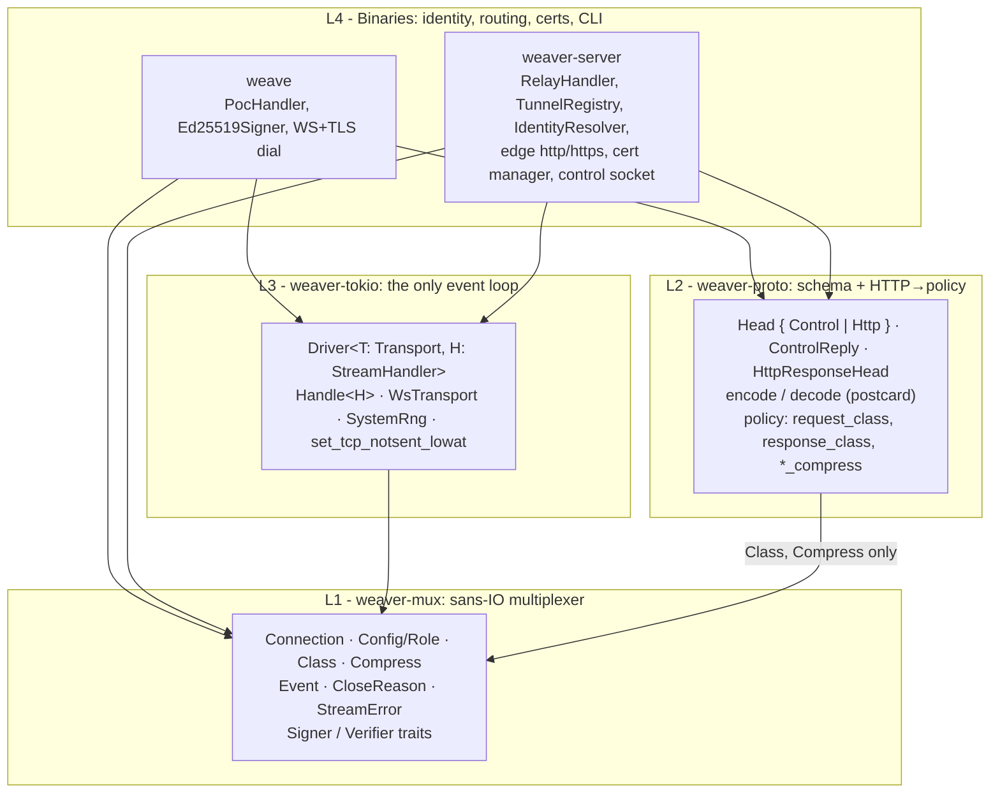
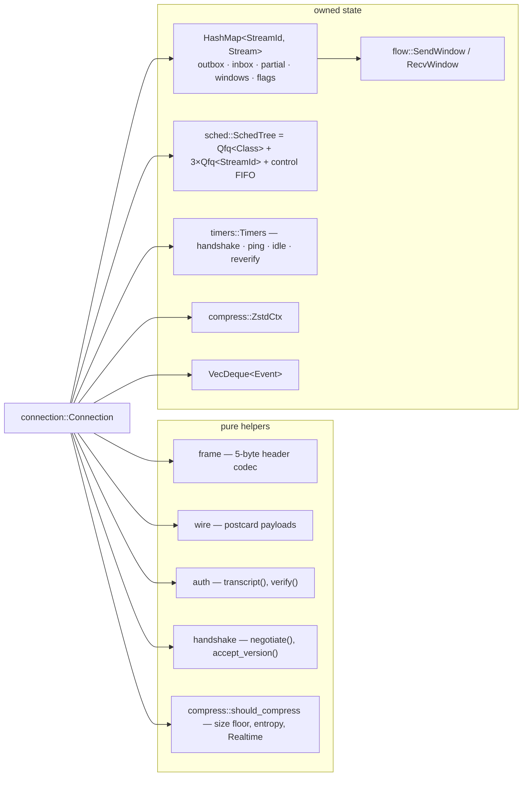
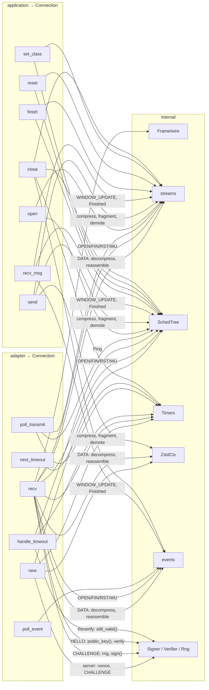
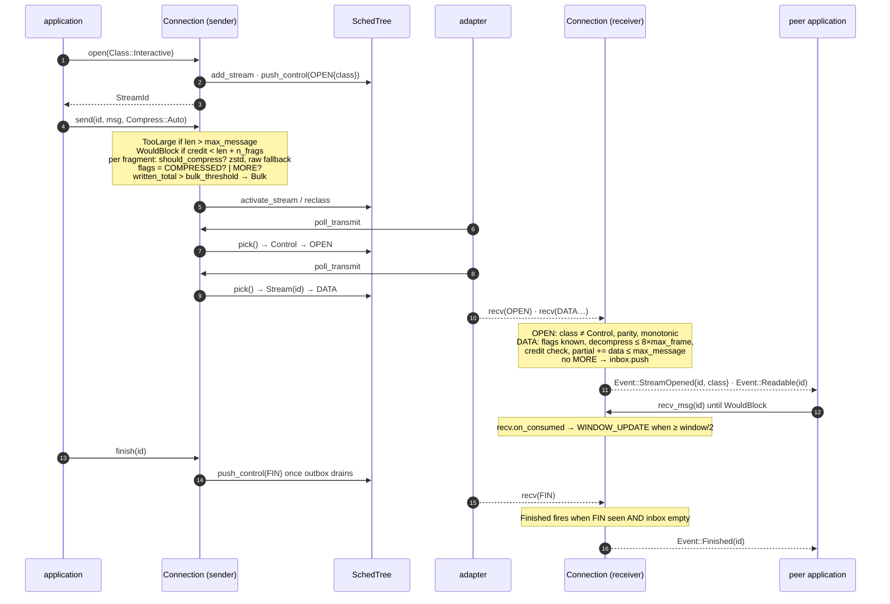
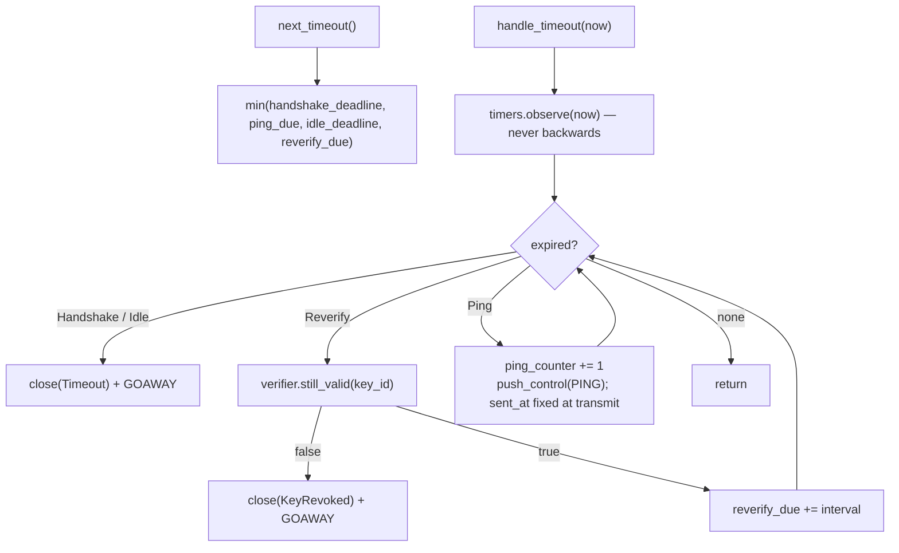
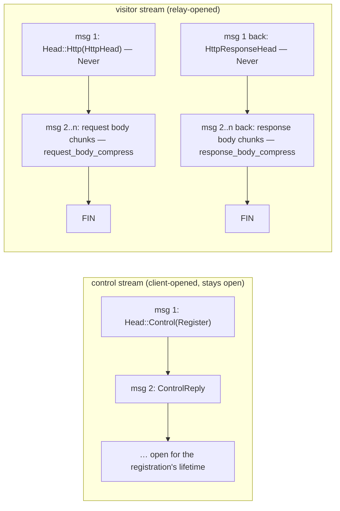
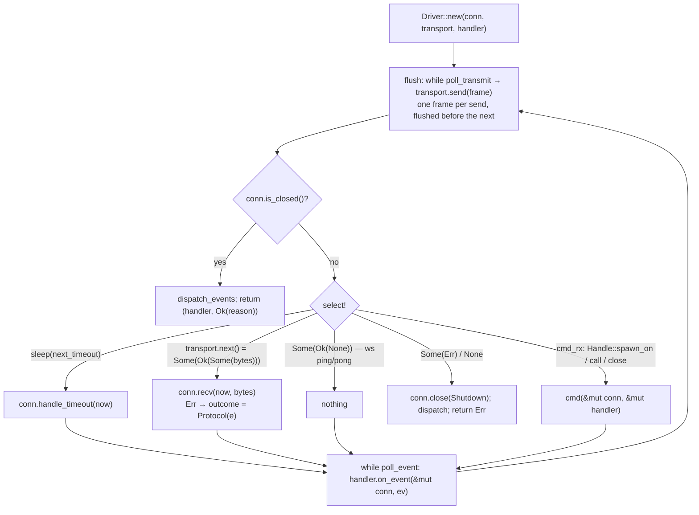
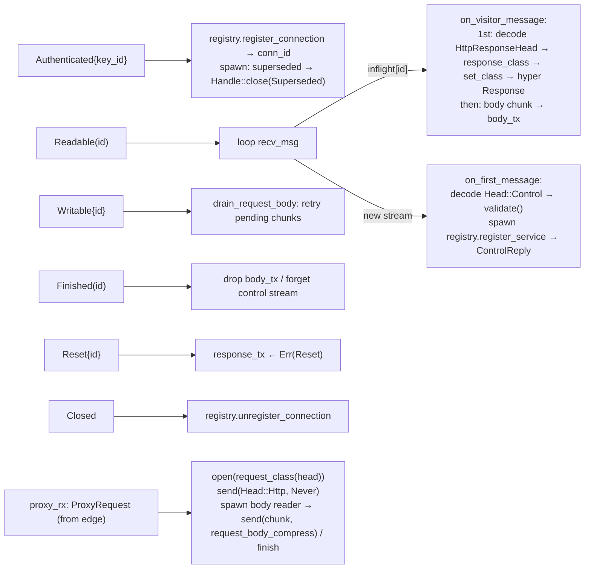
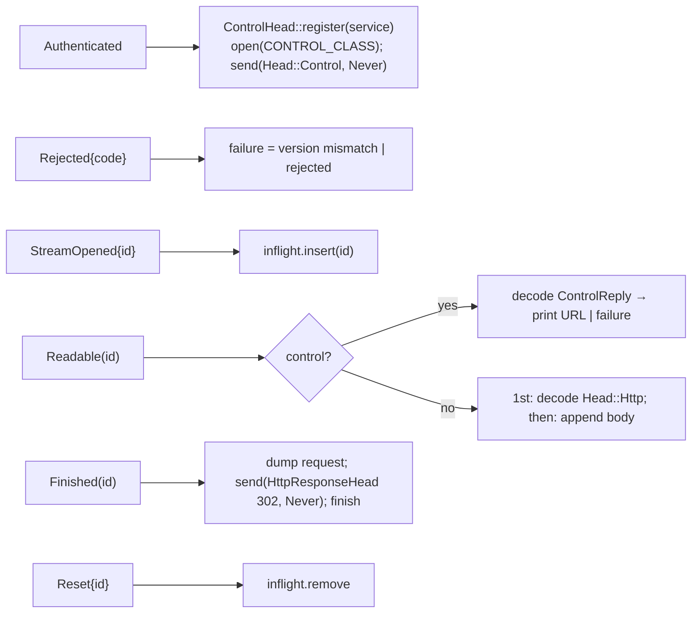

# Architecture: the layers and what crosses them

This document is the current map of the workspace's abstraction layers:
which crate owns which concept, every call that crosses a crate boundary,
and the internal call flow of the multiplexer. It is the reference for
checking that a change does not leak a concept into a layer that should
not know it, and that no two APIs cover the same concern.

Decisions behind this shape: ADR 0002 (transport and mux), 0003 (tunnel
protocol), 0004 (stream policy and messages), 0005 (minimal mux surface).

## 1. Layer map



| Layer | Knows | Does not know |
|---|---|---|
| `weaver-mux` | classes, per-message compression stance, credit, frames, `KeyId` | MIME, HTTP, hostnames, identities, schemas, sockets, clocks |
| `weaver-proto` | HTTP/control schemas, HTTP → `Class`/`Compress` rules, proto version | sockets, tokio, who a key is |
| `weaver-tokio` | how to pump a `Connection` over a `Sink + Stream` | schemas, policy rules |
| binaries | identity, routing, certs, CLI | frame layout, scheduler |

The graph is acyclic and each crate depends only on layers below it.

## 2. `weaver-mux`

### 2.1 Public surface

Everything an application can name, in one place (`lib.rs`). `wire` is
public only so tests and fuzz targets can hand-craft frames.

```mermaid
classDiagram
    class Connection {
        +new(Config, now) Connection
        +recv(now, bytes) Result~(), ProtocolError~
        +poll_transmit(now, buf) bool
        +handle_timeout(now)
        +next_timeout() Option~Instant~
        +poll_event() Option~Event~
        +open(Class) Result~StreamId, StreamError~
        +send(id, msg, Compress) Result~(), StreamError~
        +recv_msg(id) Result~Vec~u8~, StreamError~
        +finish(id) Result~(), StreamError~
        +reset(id, code) Result~(), StreamError~
        +set_class(id, Class) Result~(), StreamError~
        +close(CloseReason)
        +is_closed() bool
        +version() Option~u16~
        +params() Option~Params~
        +rtt() Option~Duration~
        +class_of(id) Option~Class~
        +pending_messages(id) Option~usize~
    }
    class Config {
        role: Role
        rng: Box~dyn Rng~
        server_name: String
        weights: Weights
        bulk_threshold: Option~u64~
        zstd_level: i32
        compression_allowed: bool
        handshake_timeout / ping_interval / idle_timeout
        channel_binding: Option~[u8;32]~
        +client(signer, name, rng)
        +server(verifier, name, rng)
        +server_params_mut() Option~&mut ServerParams~
    }
    class Role {
        <<enum>>
        Client { signer }
        Server { verifier, params: ServerParams, reverify_interval }
    }
    class Class {
        <<enum>>
        Control · Realtime · Interactive · Bulk
    }
    class Compress {
        <<enum>>
        Auto · Never
    }
    class Event {
        <<enum>>
        Authenticated { key_id, version }
        Rejected { code: RejectCode, message }
        StreamOpened { id, class }
        Readable(id)
        Writable { id, credit }
        Finished(id)
        Reset { id, code }
        Closed { reason: CloseReason }
    }
    class CloseReason {
        code: CloseCode
        message: Option~String~
    }
    class Signer {
        <<trait>>
        key_id() KeyId
        sign(msg) Result~Signature, SignError~
    }
    class Verifier {
        <<trait>>
        public_key(&KeyId) Option~PublicKey~
        still_valid(&KeyId) bool
    }
    Connection --> Config
    Config --> Role
    Role --> Signer
    Role --> Verifier
    Connection ..> Event : emits
    Connection ..> Class
    Connection ..> Compress
    Connection ..> CloseReason
```

Vocabulary, one name per concept:

| Concept | Name |
|---|---|
| how a stream is scheduled | `Class` |
| whether one message may be compressed | `Compress` |
| why a connection closed (API, event, GOAWAY payload) | `CloseReason` / `CloseCode` |
| why a handshake was refused (REJECT payload) | `RejectCode` |
| why a stream was aborted | `u32` code in `reset` / `Event::Reset` |
| what the server announces | `ServerParams` (config) → `Params` (wire) |

### 2.2 Module graph



Enforced inside the crate: `#![forbid(clippy::disallowed_methods)]` +
`clippy.toml` ban `Instant::now`, `SystemTime::now` and RNG calls. Time
enters only as `now`; randomness only via `Config::rng`. Keys never enter:
the crate sees a `KeyId` and a `Signature`.

### 2.3 What each public call touches



Only `new`, `recv` and `handle_timeout` reach the adapter-supplied traits.
Every stream method goes through one `ready()` check: `Closed` after
close, `NotAuthenticated` before WELCOME.

### 2.4 Handshake

```mermaid
sequenceDiagram
    autonumber
    participant CA as client adapter
    participant CC as client Connection
    participant SC as server Connection
    participant SA as server adapter
    participant S as dyn Signer
    participant V as dyn Verifier

    SA->>SC: new(Config::server(..), now)
    Note over SC: rng → nonce_s; handshake_out ← CHALLENGE
    SA->>SC: poll_transmit
    SC-->>CA: CHALLENGE{nonce_s}
    CA->>CC: recv
    Note over CC: rng → nonce_c<br/>msg = transcript(nonce_s, nonce_c, server_name, channel_binding)
    CC->>S: key_id(), sign(msg)
    Note over CC: handshake_out ← HELLO{version, key_id, nonce_c, sig}
    CA->>CC: poll_transmit
    CC-->>SA: HELLO
    SA->>SC: recv
    Note over SC: negotiate(version) → REJECT UnsupportedVersion
    SC->>V: public_key(key_id) → None → REJECT UnknownKey
    Note over SC: verify(sig) false → REJECT BadSignature<br/>WELCOME{version, Params from ServerParams}<br/>hs = Done, timers.on_authenticated
    SC-->>SA: Event::Authenticated
    SA->>SC: poll_transmit
    SC-->>CA: WELCOME
    CA->>CC: recv
    Note over CC: accept_version, range-check Params<br/>rebuild SchedTree with max_frame<br/>compression_enabled = local && server allowed
    CC-->>CA: Event::Authenticated
```

REJECT closes the server side without GOAWAY and yields
`Event::Rejected` then `Event::Closed` on the client.

### 2.5 One message, end to end



Stream release is automatic: once both halves are closed, FIN queued,
outbox empty and `Finished` delivered, the stream is forgotten. No extra
read is required.

### 2.6 Timers



## 3. `weaver-proto`

A schema crate plus the single place that translates HTTP into mux
vocabulary. No state, no I/O, no mux driving.

```mermaid
classDiagram
    class Head {
        <<enum>>
        Control(ControlHead)
        Http(HttpHead)
    }
    class ControlHead {
        <<enum>>
        Register { proto_version, service }
        +register(service) Result~Self, RefusalCode~
        +validate() Result~(), RefusalCode~
    }
    class ControlReply {
        <<enum>>
        Registered { hostname }
        Refused { code: RefusalCode, message }
    }
    class HttpHead {
        method, scheme, authority, path
        headers: Vec~(String, Vec~u8~)~
        +header(name) Option~&[u8]~
    }
    class HttpResponseHead {
        status: u16
        headers
        +header(name)
    }
    class codec {
        <<fns>>
        encode(&T) Result~Vec~u8~, CodecError~
        decode(&[u8]) Result~T, CodecError~
        accept_protocol_version(u16)
        is_valid_dns_label(&str)
    }
    class policy {
        <<module>>
        CONTROL_CLASS = Interactive
        CONTROL_COMPRESS = Never
        HEAD_COMPRESS = Never
        BULK_THRESHOLD = 256 KiB (declared size)
        request_class(&HttpHead) Class
        response_class(&HttpHead, &HttpResponseHead) Option~Class~
        request_body_compress(&HttpHead) Compress
        response_body_compress(&HttpHead, &HttpResponseHead) Compress
    }
    Head --> ControlHead
    Head --> HttpHead
    ControlReply --> RefusalCode
    policy ..> HttpHead
    policy ..> HttpResponseHead
    policy ..> mux_Class["weaver_mux::Class"]
    policy ..> mux_Compress["weaver_mux::Compress"]
```

Stream conventions (all in `weaver-proto` docs, enforced by the handlers):



Policy rules, in the order they apply:

| Decision | Rule |
|---|---|
| `request_class` | `Upgrade` or `Accept: text/event-stream` → `Realtime`; declared `Content-Length` > 256 KiB → `Bulk`; else `Interactive` (mux demotes after `bulk_threshold` sent bytes) |
| `response_class` | request already realtime → keep; response `text/event-stream` → `Realtime`; declared length > 256 KiB → `Bulk` |
| heads | always `Never` (cookies, tokens, CSRF secrets) |
| bodies | `Never` if realtime, `Content-Encoding` set, MIME pre-compressed, or request carries `Authorization`/`Cookie` and the response is `text/html` / `application/json` / `xhtml` (BREACH); else `Auto` |

## 4. `weaver-tokio`



Public surface: `Driver`, `Handle<H>` (`spawn_on`, `call`, `close`),
`StreamHandler::on_event`, `DriverError`, `Transport`, `WsTransport`,
`SystemRng`, `set_tcp_notsent_lowat`. It re-exports nothing from
`weaver-mux`; binaries import mux types from `weaver_mux` directly.

## 5. Binaries: the two `StreamHandler`s

### 5.1 Relay (`weaver-server/src/tunnel/connection.rs`)



### 5.2 Client (`weave/src/poc.rs`)



### 5.3 A visitor request through every layer

```mermaid
sequenceDiagram
    autonumber
    participant Vis as visitor (HTTPS)
    participant Edge as edge::https (hyper)
    participant Reg as TunnelRegistry
    participant RH as RelayHandler
    participant SM as mux (server)
    participant WS as WebSocket/TLS
    participant CM as mux (client)
    participant PH as PocHandler

    Vis->>Edge: GET https://web.laptop.poc.root/
    Edge->>Reg: lookup(host) → proxy_tx
    Edge->>RH: ProxyRequest{HttpHead, body, response_tx}
    RH->>SM: open(policy::request_class(head))
    RH->>SM: send(id, encode(Head::Http), HEAD_COMPRESS)
    RH->>SM: send(id, chunk, request_body_compress) … finish(id)
    SM-->>WS: OPEN{class} · DATA … · FIN
    WS-->>CM: recv ×n
    CM-->>PH: StreamOpened · Readable · Finished
    PH->>CM: recv_msg → Head::Http, body
    PH->>CM: send(id, encode(HttpResponseHead), HEAD_COMPRESS); finish(id)
    CM-->>WS: DATA · FIN
    WS-->>SM: recv
    SM-->>RH: Readable(id)
    RH->>SM: recv_msg → HttpResponseHead
    RH->>SM: set_class(id, response_class(..)) if any
    RH->>Edge: response_tx ← Response
    Edge-->>Vis: 302
    SM-->>RH: Finished(id) → drop body_tx
```

## 6. Boundary checklist

What to verify when touching a boundary. Each row is currently true.

| Boundary | Invariant | Enforced by |
|---|---|---|
| mux ⟂ time / randomness | only `now` parameters and `Config::rng` | clippy `disallowed_methods`, `#![forbid]` |
| mux ⟂ keys | `Signer`/`Verifier` traits; mux sees `KeyId` + `Signature` | `Role` enum carries exactly one of them |
| mux ⟂ content | OPEN carries only `Class`; DATA is opaque bytes + flags | `wire.rs` has no MIME/HTTP types; `compress` is content-agnostic |
| mux ⟂ transport | one `recv` = one message; one `poll_transmit` = one frame; no length prefix | `Driver::flush`; `frame.rs` header has no length |
| proto → mux | uses `Class` and `Compress` only, never `Connection` | `weaver-proto/Cargo.toml` + `policy.rs` imports |
| proto ⟂ identity | no keys, no hostnames | `identity` lives in `weave` and `weaver-server` |
| tokio ⟂ schema | `Driver` is generic in `H: StreamHandler`; never decodes | `weaver-tokio` does not depend on `weaver-proto` |
| one name per concept | `Class`, `Compress`, `CloseReason`, `RejectCode`, reset `u32` | ADR 0005 table |
| uniform stream API | every stream method → `ready()`; accessors → `Option` | `Connection::ready`, `class_of`, `pending_messages` |
| no hidden code | every `pub` item has a production caller, or is a test/fuzz hook under `wire`/`testing` | ADR 0005 |
| schema validation at the schema | service name and proto version checked by `ControlHead::register` / `validate` on both ends | `control.rs`; registry does not re-validate |
