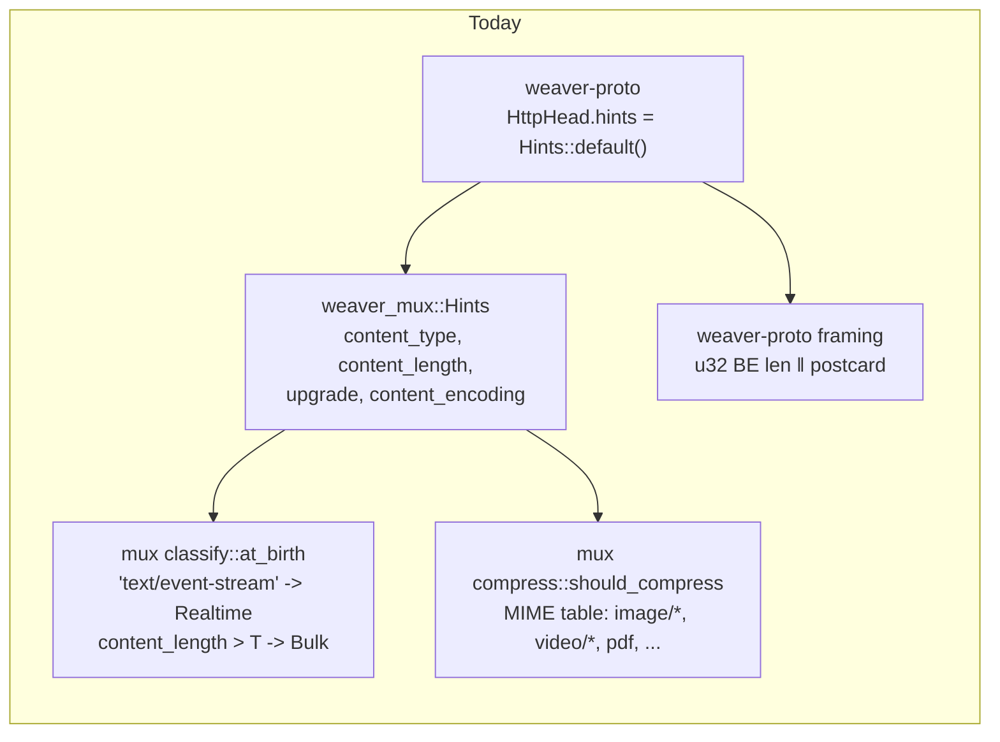
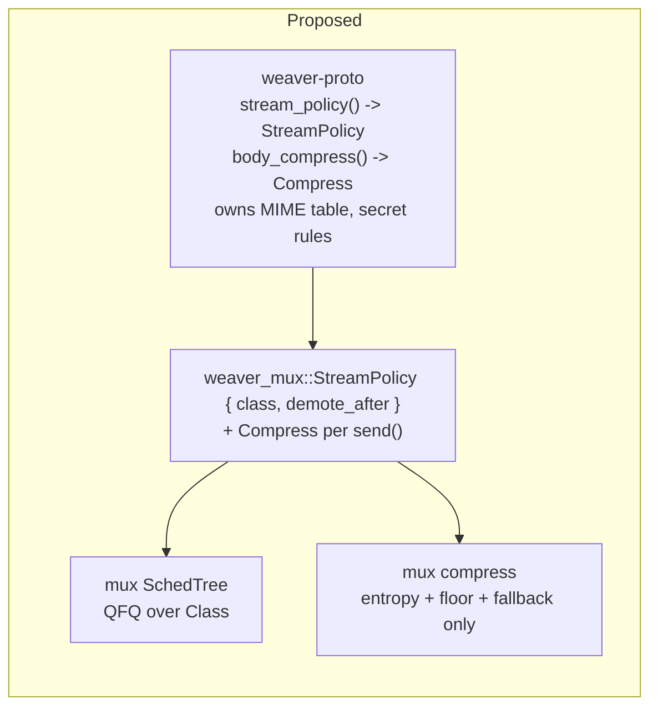
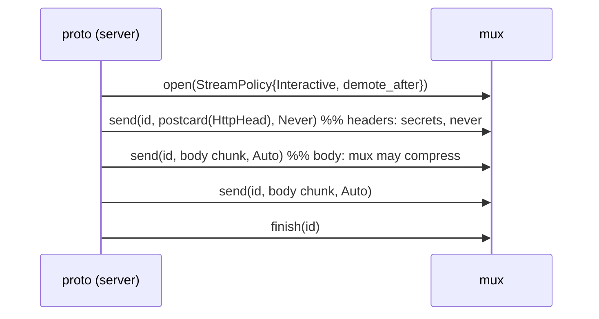
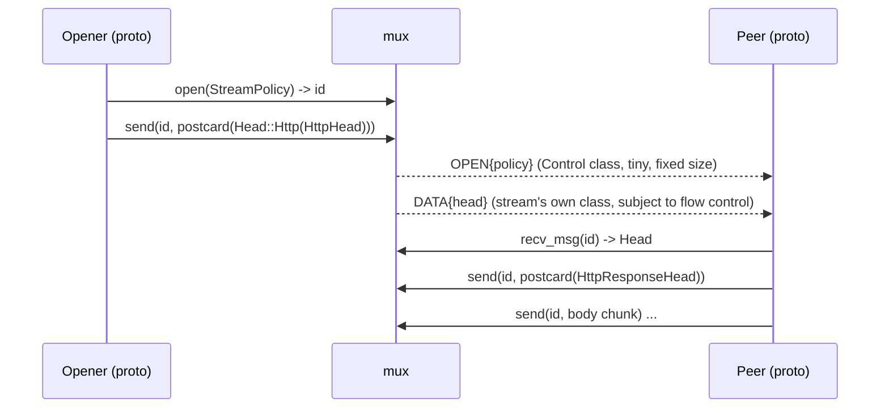
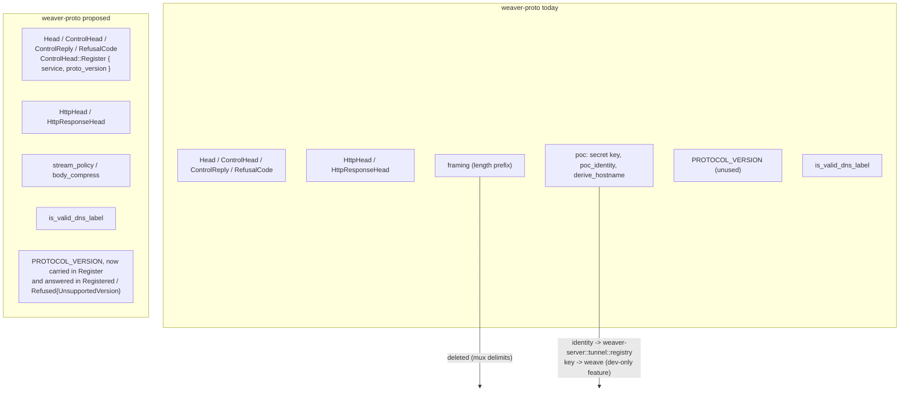
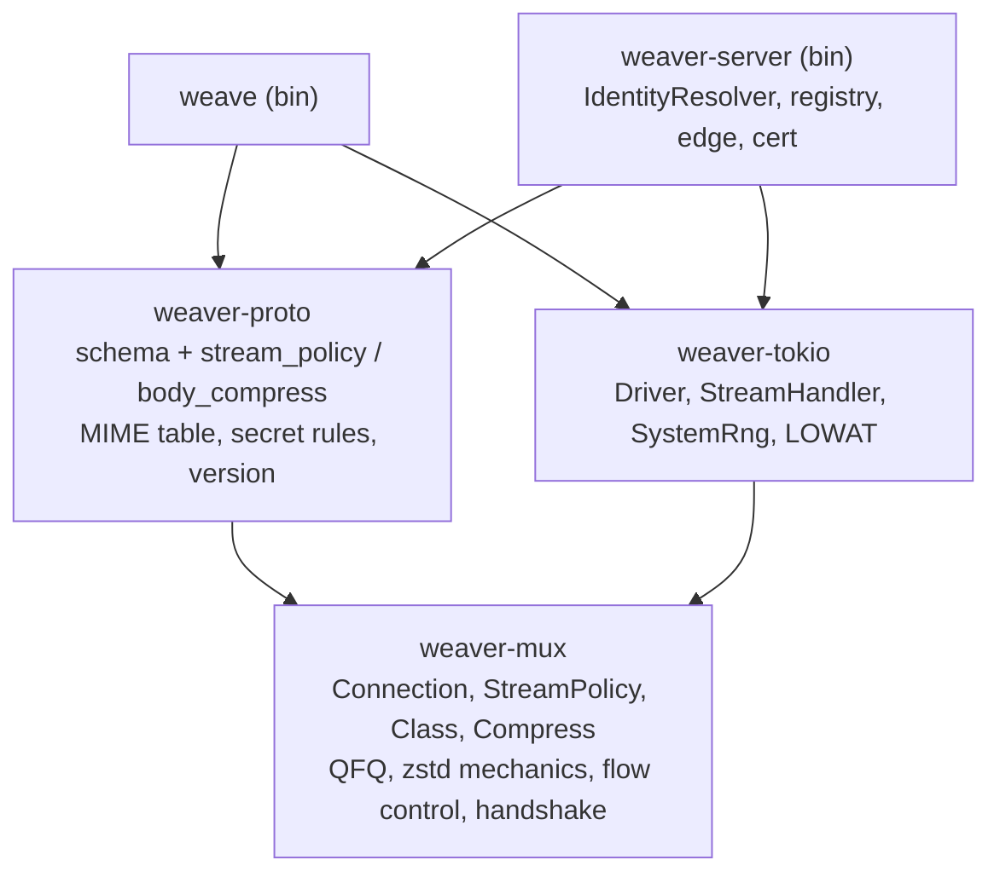

# Proposal: explicit stream policy and a message-oriented stream API

Status: implemented (see ADR 0004)
Depends on: `docs/architecture-layers.md` (audit), ADR 0002, ADR 0003

## 1. Objectives this must satisfy

| # | Objective | What it means for the design |
|---|---|---|
| O1 | QFQ between different kinds of streams | The mux owns the scheduler; the layer above decides which class a stream belongs to. |
| O2 | Smart compression: never compress secrets, never recompress compressed data | The mux owns the codec; the layer above says whether a stream *may* be compressed, and the mux may still decline (entropy, size). |
| O3 | Mux knows nothing about proto; proto tells the mux what to do | The mux exposes a **policy vocabulary** (class, compression stance, priority), not a **content vocabulary** (MIME, Content-Length, Upgrade). Proto translates HTTP semantics into that vocabulary. |
| O4 | Message length is the transport's job | No length prefixes anywhere in our stack. One WebSocket message = one mux frame; one mux DATA frame = one application message. |
| O5 | Each layer knows nothing about layers above | mux ← proto ← adapter ← binary, with no upward type or string coupling. |

## 2. Diagnosis: why the current design violates them



* **O3 violated in reverse.** `Hints` is an HTTP vocabulary embedded in the
  mux (`wire.rs:118-131`); the mux carries a MIME table
  (`compress.rs:44-70`) and knows what `text/event-stream` means. The mux
  therefore knows about *the thing above it*, and proto cannot express
  anything the MIME heuristics do not already cover (e.g. "this is a
  secret", "this is a control message").
* **O2 not achievable.** There is no way to say "this stream carries
  secrets, do not compress it" except by lying about the content type. The
  CRIME/BREACH concern is only handled indirectly through `Realtime`.
* **O1 half-wired.** The server sends `Hints::default()`
  (`tunnel/proxy.rs:166`), so every stream is `Small` until it crosses the
  byte threshold. The scheduler runs on empty input.
* **O4 violated.** `weaver_proto::framing` adds a length prefix inside
  DATA, then adapters reassemble it with a `read_buf`. The mux already
  guarantees frame boundaries because WebSocket does; we throw that away by
  exposing a byte-stream `read()`.
* **O5 violated.** `weaver_proto::poc` holds relay policy and key
  material; `weaver_proto::Head::to_mux_head` names `weaver_mux::wire::Head`.

## 3. Proposal

### 3.1 The mux exposes a policy vocabulary, not content hints

Replace `Hints` with `StreamPolicy`, chosen entirely by the caller:

```rust
// weaver-mux
pub enum Class { Control, Realtime, Interactive, Bulk }   // Control still reserved

pub enum Compress {
    /// Never. For secrets, tokens, anything under an attacker-influenced
    /// channel (CRIME/BREACH), and already-encoded payloads.
    Never,
    /// The mux may compress if it judges it worthwhile (size floor,
    /// entropy probe, incompressible-frame fallback). Default.
    Auto,
}

/// Scheduling only. Compression is chosen per message at `send` (see 3.3b).
pub struct StreamPolicy {
    pub class: Class,
    /// Reclassify to Bulk after this many bytes; None = never demote.
    pub demote_after: Option<u64>,
}

pub struct Head {
    pub policy: StreamPolicy,
    pub opaque: Vec<u8>,          // proto's business, unchanged
}
```

What disappears from the mux: `Hints`, `classify::at_birth`'s MIME
rules, `mime_is_precompressed`, `mime_essence`. What stays: the entropy
probe, the 1 KiB floor, the "compressed frame larger than raw → send raw"
fallback, the `Realtime → never compress` rule (now expressed as
`Compress::Never` being forced when `class == Realtime`, documented as a
mux invariant, not a MIME lookup).

`set_class` stays as the runtime override, renamed `set_policy(id,
StreamPolicy)`.



The mux is now a pure mechanism: it can be fuzzed and property-tested on
`StreamPolicy` alone, and the whole HTTP heuristic layer becomes
unit-testable in proto without a `Connection`.

### 3.2 Proto owns the HTTP → policy translation

```rust
// weaver-proto
pub fn stream_policy(head: &HttpHead) -> StreamPolicy;                       // class, demote
pub fn body_compress(req: &HttpHead, resp: Option<&HttpResponseHead>) -> Compress;
// heads themselves are always sent with Compress::Never
```

Rules, all in one place and all testable without the mux:

| Observation (HTTP) | `StreamPolicy` | body `Compress` |
|---|---|---|
| `Upgrade:` present, or `Accept: text/event-stream`, or response `Content-Type: text/event-stream` | `Realtime` | `Never` |
| `Content-Encoding` present | unchanged | `Never` |
| `Content-Type` in the pre-compressed table (`image/*` except svg, `video/*`, `audio/*`, `font/woff*`, zip/gzip/zstd/xz/pdf/wasm/octet-stream) | unchanged | `Never` |
| Request carries `Authorization`/`Cookie` and response body is `text/html` or `application/json` (attacker-reflectable) | unchanged | `Never` (BREACH) |
| `Content-Length > bulk_threshold` | `Bulk` | `Auto` |
| otherwise | `Interactive`, `demote_after = Some(bulk_threshold)` | `Auto` |
| Control stream | `Interactive`, `demote_after = None` | `Never` (all messages) |

"Do not compress secrets" becomes an explicit rule in proto instead of a
side effect of the MIME string chosen for control streams, and heads are
never compressed regardless of what the body rule says.

### 3.3 One message = one frame: message-oriented stream API

Since WebSocket delimits messages and the mux keeps one frame per message
(O4), the mux should hand application messages back with their boundaries
intact instead of flattening them into a byte stream.

```rust
// weaver-mux, replaces read()/write()
pub fn send(&mut self, id: StreamId, msg: &[u8]) -> Result<(), StreamError>;
//   Err(WouldBlock) if the message does not fit in free credit; nothing is
//   queued partially. A message larger than max_frame is split into
//   consecutive DATA frames with a CONTINUATION flag bit; the receiver
//   reassembles before delivering.
pub fn recv_msg(&mut self, id: StreamId) -> Result<Vec<u8>, StreamError>;
//   Exactly one message, or WouldBlock, or Ok(empty)+Finished semantics.
```

DATA payload becomes `flags ‖ body` where `flags` has `COMPRESSED` (0x01,
already exists) and `MORE` (0x02, this message continues in the next
frame). The receiver's inbox becomes `VecDeque<Message>` instead of chunks.

Consequences:

* `weaver_proto::framing` is deleted. `ControlReply` and
  `HttpResponseHead` are one postcard message each, sent with `send`.
* Adapters lose the `read_buf` / `head_parsed` reassembly logic
  (`tunnel/connection.rs:47-53`, `weave/src/poc.rs:157`).
* The 64 KiB cap moves to `Config::max_message` in the mux and is
  enforced during reassembly, so a hostile peer cannot grow the inbox
  unboundedly. This is the correct layer for it: it is a resource bound,
  not a schema rule.
* Request heads and response heads are now encoded the same way
  (finding 2 of the audit).

### 3.3b Two knobs, two scopes: class per stream, compression per message

A stream-wide compression stance cannot express "do not compress the HTTP
head, compress the body" — which is the actual BREACH shape: secrets live
in headers (`Set-Cookie`, `Authorization`, CSRF tokens), the compressible
bulk is the body. The two knobs have different natural scopes:

| Knob | Scope | Why |
|---|---|---|
| `class` (and `demote_after`) | stream | The scheduler orders frames per flow; letting messages of one stream sit in two QFQ flows would let a later message overtake an earlier one and break in-order delivery. |
| `compress` | message | The `COMPRESSED` flag is already per DATA frame; compression does not affect ordering, so nothing forces it to be sticky. |

So `StreamPolicy` shrinks to scheduling only, and compression moves to
`send`:

```rust
pub struct StreamPolicy { pub class: Class, pub demote_after: Option<u64> }

pub enum Compress { Never, Auto }

pub fn send(&mut self, id: StreamId, msg: &[u8], compress: Compress)
    -> Result<(), StreamError>;
```

A **segment** is then just a run of consecutive messages sent with the
same `Compress`; it needs no wire representation and no receiver-side
concept, because the receiver already decides per frame from the flag.
Proto's convention becomes:



and the proto helpers split accordingly:

```rust
pub fn stream_policy(head: &HttpHead) -> StreamPolicy;           // class only
pub fn body_compress(req: &HttpHead, resp: Option<&HttpResponseHead>) -> Compress;
// Never if Content-Encoding is set, MIME is pre-compressed, class is
// Realtime, or the exchange carries auth material and the body may reflect
// attacker input (proto's BREACH rule); Auto otherwise. Heads are always Never.
```

Mux-side mechanics under `Auto` stay as they are, evaluated per message
instead of once per stream: size floor, entropy probe, and "compressed
output not smaller → send raw". The `Realtime ⇒ Never` invariant is
enforced by the mux regardless of what the caller passes. For a message
split across frames with `MORE`, each fragment is compressed independently
so the per-frame decompression cap (`8 × max_frame`) keeps applying.

Ordering of `set_policy` relative to `send` is no longer a concern for
compression at all; `set_policy` only ever moves the whole stream between
classes, as `set_class` does today.

### 3.4 OPEN carries policy only; the application head is the first message

To keep control frames small (the scheduler's `lmax` problem in
`sched/mod.rs:60-62`) and to make request and response symmetric:



`wire::Head::opaque` goes away; `Event::StreamOpened { id, policy }`
carries no application bytes. The proto crate defines the convention
"first message on a stream is the `Head`", which is its layer's decision.

### 3.5 Proto loses everything that is not schema



* `poc` moves out: `poc_identity`/`derive_hostname` become a
  `trait IdentityResolver` in the server (`registry.rs` already is the
  only caller); the PoC key becomes a `--dev-key` feature of `weave`.
* `PROTOCOL_VERSION` gets a job: `ControlHead::Register` carries it, the
  relay answers `Refused { UnsupportedVersion }` if unsupported. Mux version
  and proto version are then both negotiated, each at its own layer.
* Public signatures use `weaver_mux::Head`, `weaver_mux::StreamPolicy`
  (re-exports), never `weaver_mux::wire::*`. `wire` can then become
  `pub(crate)` except for the fuzz/test feature.

### 3.6 A real L3: `weaver-tokio`

One crate hosting the duplicated adapter code (audit finding 10):

```rust
pub struct Driver<T> { conn: Connection, transport: T, buf: Vec<u8> }
impl<T: Sink<Bytes> + Stream<Item = Bytes> + Unpin> Driver<T> {
    pub async fn run(self, handler: impl StreamHandler) -> Result<GoAway, DriverError>;
}
pub trait StreamHandler {
    fn on_authenticated(&mut self, cx: &mut Cx, key: KeyId);
    fn on_stream_opened(&mut self, cx: &mut Cx, id: StreamId, policy: StreamPolicy);
    fn on_message(&mut self, cx: &mut Cx, id: StreamId, msg: Vec<u8>);
    fn on_writable(&mut self, cx: &mut Cx, id: StreamId);
    fn on_finished(&mut self, cx: &mut Cx, id: StreamId);
    fn on_reset(&mut self, cx: &mut Cx, id: StreamId, code: u32);
}
pub struct SystemRng;               // the one copy
pub fn set_tcp_notsent_lowat(...);  // applied on both ends
```

`Driver` enforces the two adapter rules from the mux docs (one frame per
`poll_transmit`, flush before the next), owns the WebSocket Ping/Pong
reply, and handles `Finished` by draining remaining messages so the mux
can release the stream (audit finding 6 becomes impossible to get wrong).
`weaver-tokio` depends on mux only; proto and binaries depend on it.

### 3.7 Small API hygiene in the mux

* `ready()` applied uniformly to `recv_msg`, `set_policy` (finding 7).
* `Event::Finished` fires only after the inbox drains; the mux marks EOF
  itself, so no "must call read after FIN" contract (finding 6).
* Drop `wire::Goaway` alias (finding 5).
* `Class::Small` renamed `Interactive` (it is the class for latency-bound
  request/response, not a size).

## 4. Resulting layer graph



Knowledge per layer:

| Layer | Knows | Does not know |
|---|---|---|
| `weaver-mux` | classes, per-message compression stance, credit, frames, keys as `KeyId` | MIME, HTTP, hostnames, identities, message schemas |
| `weaver-proto` | HTTP/control schemas, how to map them to `StreamPolicy`, proto version | sockets, tokio, who a key belongs to |
| `weaver-tokio` | how to pump a `Connection` over a `Sink+Stream` | schemas, policy rules |
| binaries | identity, routing, certs, CLI | frame layout, scheduler |

## 5. Wire changes (as implemented, the version stays 1 until 1.0)

| Frame | before | after |
|---|---|---|
| OPEN payload | `Head { hints: Hints, opaque }` | `StreamPolicy { class, demote_after }` |
| DATA flags | `COMPRESSED` | `COMPRESSED`, `MORE` |
| DATA body | raw bytes, proto adds `u32 len` for heads | one application message (possibly continued) |
| WELCOME params | `max_frame, initial_window, compression` | `+ max_message` |
| Control `Register` | `{ service }` | `{ service, proto_version }` |

Decision at implementation time: pre-1.0 the protocol carries no
compatibility promise, so the format changes ship under the unchanged
`weaver-mux-v1` identifier rather than bumping to v2.

## 6. Migration order

Each step compiles and passes the suite on its own.

1. **mux:** add `StreamPolicy`, `Compress`, `max_message`; keep `Hints`
   behind `#[deprecated]` mapped through the old classifier. Add
   `send(id, msg, Compress)` / `recv_msg` with `MORE` reassembly alongside
   `read`/`write`; compression decided per message.
2. **proto:** add `stream_policy` / `body_compress`; switch `Head::to_mux_head`
   to emit `StreamPolicy`. Delete `framing`; heads become first message.
3. **adapters:** create `weaver-tokio`, port server loop, then client loop.
   Delete both `SystemRng` copies and reassembly buffers.
4. **mux cleanup:** remove `Hints`, MIME table, `read`/`write`, `Goaway`
   alias; rename `Small`; make `wire` `pub(crate)` outside `test-util`.

5. **proto/server:** move `poc` out; add `IdentityResolver`; carry
   `proto_version` in `Register`.
6. Update ADR 0002/0003; supersede the "stream 1" wording.

## 7. What this does *not* change

* QFQ algorithm, weights, two-level tree — untouched; it just receives
  real input.
* Handshake, `Signer`/`Verifier`, sans-IO discipline, timers.
* WebSocket as the transport; `TCP_NOTSENT_LOWAT` rule (now applied on
  both ends via `weaver-tokio`).
